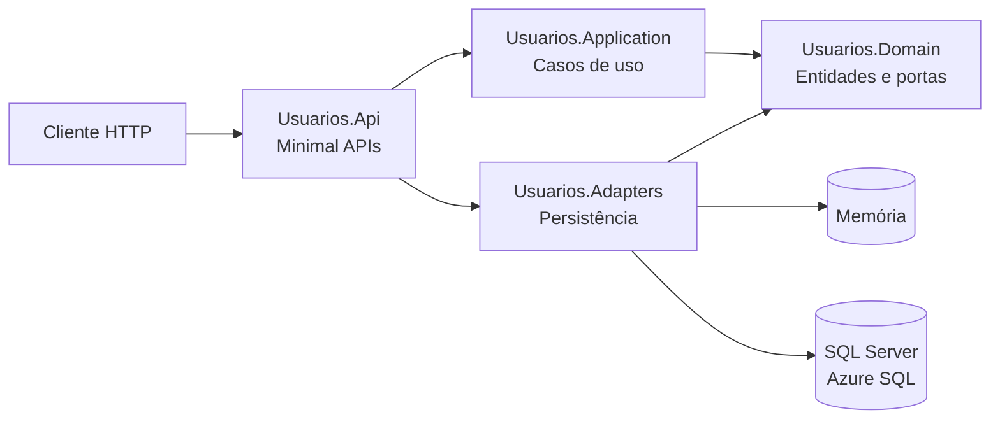

# Usuários API

API REST para cadastro e gerenciamento de usuários, desenvolvida com .NET 10, ASP.NET Core Minimal APIs e arquitetura Ports and Adapters.

A aplicação pode usar persistência em memória para desenvolvimento rápido ou SQL Server/Azure SQL Database por meio do Entity Framework Core. O projeto também inclui documentação OpenAPI, health checks, testes automatizados, containerização e pipeline DevSecOps para Azure Container Apps.

## Tecnologias

- .NET 10 e ASP.NET Core Minimal APIs
- Entity Framework Core 10
- SQL Server e Azure SQL Database
- OpenTelemetry, Application Insights e Live Metrics
- OpenAPI, Swagger UI e Scalar UI
- xUnit
- Docker e Docker Compose
- GitHub Actions
- Azure Container Apps e Azure Container Registry

## Arquitetura



```text
src/
|-- Usuarios.Api/           # Endpoints, contratos e composição da aplicação
|-- Usuarios.Application/   # Serviços e comandos de aplicação
|-- Usuarios.Domain/        # Entidades, erros e portas
`-- Usuarios.Adapters/      # Repositórios e persistência com EF Core

tests/
`-- Usuarios.Tests/         # Testes da API e da camada de aplicação
```

O modo de persistência é selecionado automaticamente:

| Configuração | Repositório utilizado |
| --- | --- |
| Sem `ConnectionStrings__UsersDatabase` | Repositório em memória |
| Com `ConnectionStrings__UsersDatabase` | SQL Server por meio do EF Core |

## Pré-requisitos

- [.NET SDK 10](https://dotnet.microsoft.com/download/dotnet/10.0)
- PowerShell Core
- Docker com suporte ao Docker Compose, somente para o ambiente com SQL local

No Windows, consulte também o [guia de preparação do ambiente](../pre-requisito/README.md).

Valide a instalação do SDK:

```powershell
dotnet --list-sdks
```

## Início rápido

Execute os comandos desta seção a partir da pasta `Projeto.API`.

```powershell
dotnet restore .\src\UsuariosApi.slnx
dotnet run --project .\src\Usuarios.Api\Usuarios.Api.csproj
```

Por padrão, a API inicia com persistência em memória em:

- Página inicial: `http://localhost:5266`
- Scalar UI: `http://localhost:5266/scalar/v1`
- Swagger UI: `http://localhost:5266/swagger`
- OpenAPI JSON: `http://localhost:5266/openapi/v1.json`

O terminal informa a URL efetiva caso a porta configurada não esteja disponível.

> [!NOTE]
> Os dados em memória são descartados quando a aplicação é reiniciada.

## Docker Compose com SQL

O ambiente local em containers executa a API e o Azure SQL Edge. As migrations existentes são aplicadas automaticamente na inicialização da API.

### Windows com Docker no WSL

Crie o arquivo local de ambiente:

```powershell
Copy-Item .\docker\.env.example .\docker\.env
```

Revise a senha em `docker/.env` e inicie os containers:

```powershell
wsl docker compose `
    --env-file ./docker/.env `
    -f ./docker/compose.yaml `
    up --build
```

Serviços disponíveis:

- API: `http://localhost:8081`
- SQL Edge: `localhost,1433`

Para encerrar e remover também o volume do banco:

```powershell
wsl docker compose `
    --env-file ./docker/.env `
    -f ./docker/compose.yaml `
    down --volumes --remove-orphans
```

> [!CAUTION]
> O parâmetro `--volumes` remove permanentemente os dados do banco local.

## Persistência no Azure SQL

Para usar Azure SQL durante o desenvolvimento, inicialize o User Secrets uma vez para o projeto:

```powershell
dotnet user-secrets init `
    --project .\src\Usuarios.Api\Usuarios.Api.csproj
```

Depois, armazene a connection string fora dos arquivos versionados:

```powershell
dotnet user-secrets set `
    "ConnectionStrings:UsersDatabase" `
    "Server=tcp:<servidor>.database.windows.net,1433;Initial Catalog=sql-db-users;User ID=<usuario>;Password=<senha>;Encrypt=True;TrustServerCertificate=False;Connection Timeout=30;" `
    --project .\src\Usuarios.Api\Usuarios.Api.csproj
```

A infraestrutura Terraform gera as credenciais administrativas do banco. A partir da raiz do repositório, consulte-as com:

```powershell
terraform -chdir="IaC" output -raw sql_username
terraform -chdir="IaC" output -raw sql_password
```

> [!WARNING]
> O segundo comando escreve a senha diretamente no terminal. Não publique a saída nem armazene a credencial no código-fonte.

No Azure Container Apps, a infraestrutura injeta a connection string no secret `users-database-connection-string`, exposto à aplicação como `ConnectionStrings__UsersDatabase`.

## Observabilidade

A API usa a distribuição oficial `Azure.Monitor.OpenTelemetry.AspNetCore` para coletar traces, métricas, logs e dependências e enviá-los ao Application Insights. O Live Metrics está habilitado explicitamente.

No Azure Container Apps, o Terraform expõe o secret `appinsights-connection-string` como `APPLICATIONINSIGHTS_CONNECTION_STRING`. Para habilitar a telemetria localmente sem armazenar credenciais no repositório, use User Secrets:

```powershell
dotnet user-secrets set `
    "AzureMonitor:ConnectionString" `
    "<connection-string-do-Application-Insights>" `
    --project .\src\Usuarios.Api\Usuarios.Api.csproj
```

Sem uma connection string configurada, a API inicia normalmente com a exportação de telemetria desabilitada.

## Migrations do banco

Defina uma connection string antes de criar ou aplicar migrations localmente:

```powershell
$env:ConnectionStrings__UsersDatabase = "Server=localhost,1433;Initial Catalog=users;User ID=sa;Password=<senha>;Encrypt=False;TrustServerCertificate=True;"
```

Para criar uma migration:

```powershell
dotnet ef migrations add <NomeDaMigration> `
    --project .\src\Usuarios.Adapters\Usuarios.Adapters.csproj `
    --startup-project .\src\Usuarios.Api\Usuarios.Api.csproj `
    --context Usuarios.Adapters.Persistence.UsersDbContext `
    --output-dir Persistence\Migrations
```

Para aplicar as migrations existentes:

```powershell
dotnet ef database update `
    --project .\src\Usuarios.Adapters\Usuarios.Adapters.csproj `
    --startup-project .\src\Usuarios.Api\Usuarios.Api.csproj `
    --context Usuarios.Adapters.Persistence.UsersDbContext
```

## Endpoints

| Método | Rota | Resposta de sucesso | Descrição |
| --- | --- | --- | --- |
| `GET` | `/` | `200` | Página com links da documentação e health checks. |
| `GET` | `/health/live` | `200` | Confirma que o processo está em execução. |
| `GET` | `/health/ready` | `200` | Confirma que a API e a persistência estão disponíveis. |
| `POST` | `/usuarios` | `201` | Cadastra um usuário. |
| `GET` | `/usuarios` | `200` | Lista os usuários cadastrados. |
| `GET` | `/usuarios/{usuarioId}` | `200` | Consulta um usuário pelo identificador. |
| `PUT` | `/usuarios/{usuarioId}` | `200` | Atualiza um usuário. |
| `DELETE` | `/usuarios/{usuarioId}` | `204` | Remove um usuário. |

O endpoint de readiness informa o modo de persistência atual. Ele retorna `503` quando o serviço ou o banco configurado não está disponível.

### Exemplo de requisição

```http
POST /usuarios HTTP/1.1
Content-Type: application/json

{
  "nome": "Aluno",
  "dtNascimento": "1992-03-14",
  "status": true,
  "telefones": [
    "11911112222",
    "1122223333"
  ]
}
```

## Build e testes

```powershell
dotnet build .\src\UsuariosApi.slnx
dotnet test .\src\UsuariosApi.slnx --collect:"XPlat Code Coverage"
```

O projeto possui atualmente 9 testes automatizados cobrindo os serviços de aplicação e os endpoints da API.

Para gerar relatórios HTML, Markdown, Cobertura e SonarQube:

```powershell
dotnet tool install --global dotnet-reportgenerator-globaltool

$reportTitle = "Usuarios API"
$runId = Get-Date -Format "yyyyMMddHHmmss"

reportgenerator `
    -reports:"**/TestResults/**/coverage.cobertura.xml" `
    -targetdir:"coveragereport" `
    -reportTypes:"Cobertura;Html;MarkdownSummaryGithub;SonarQube" `
    -title:"$reportTitle" `
    -filefilters:"-**/obj/**" `
    -tag:"local_${runId}"
```

Abra `coveragereport/index.html` para visualizar o relatório.

## CI/CD

Os workflows em `.github/workflows` implementam:

- restore, build e testes automatizados
- geração e validação do contrato OpenAPI
- análise de qualidade com SonarCloud
- análise de vulnerabilidades e segurança
- build e publicação da imagem no Azure Container Registry
- autenticação no Azure por OIDC, sem client secret no workflow
- implantação opcional no Azure Container Apps

O workflow principal é executado em pushes para `main` que alterem `src/**`. A execução manual permite selecionar somente build, validação de tag ou implantação completa.

## Comandos úteis

```powershell
dotnet restore .\src\UsuariosApi.slnx
dotnet build .\src\UsuariosApi.slnx
dotnet test .\src\UsuariosApi.slnx --collect:"XPlat Code Coverage"
dotnet run --project .\src\Usuarios.Api\Usuarios.Api.csproj
```

## Projeto de infraestrutura

O provisionamento do Azure Container Apps, Azure Container Registry, Azure SQL, observabilidade e integração OIDC está documentado no [README principal](../README.md).
