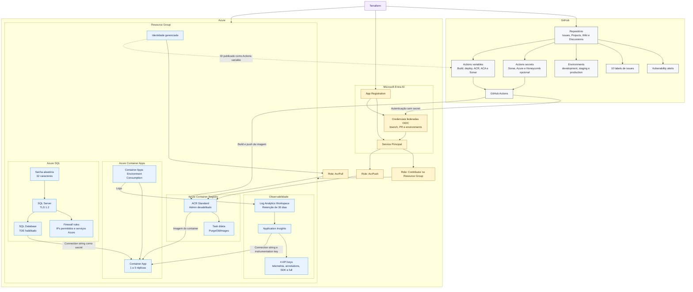

<p align="center">
  
</p>

## DevOps

Projeto final de pós-graduação para provisionar uma aplicação e sua infraestrutura no Azure, além de configurar recursos de CI/CD no GitHub.
A solução utiliza Terraform para criar recursos como Azure Container Apps, Azure Container Registry, Azure SQL Database, Application Insights e credenciais OIDC para o GitHub Actions. O repositório também inclui uma API de usuários desenvolvida em .NET.

## Visão geral

## Estrutura do repositório

```text
.
|-- IaC/                  # Configuração Terraform e módulos reutilizáveis
|   |-- environments/    # Variáveis específicas de cada ambiente
|   `-- modules/         # Módulos de infraestrutura e GitHub
|-- Projeto.API/         # Arquivos de containerização da aplicação
|-- src/                 # Solução .NET e projetos da API
|-- tests/               # Testes automatizados
|-- scripts/             # Scripts auxiliares de provisionamento
`-- pre-requisito/       # Preparação automatizada do ambiente local
```

## Módulos Terraform
| Módulo | Responsabilidade |
| --- | --- |
| `azure-resource-group` | Cria o Resource Group que agrupa os recursos do projeto. |
| `azure-acr` | Cria o Azure Container Registry e configura a limpeza de imagens antigas. |
| `azure-containers-apps` | Cria o ambiente e a aplicação no Azure Container Apps. |
| `azure-sql-database` | Cria o Azure SQL Server, o banco de usuários e uma senha administrativa aleatória. |
| `azure-logs` | Configura Log Analytics Workspace e Application Insights. |
| `repo` | Cria e configura o repositório no GitHub. |
| `repo-env` | Cria os ambientes `development`, `staging` e `production` no GitHub. |
| `repo-labels` | Configura as labels do repositório. |
| `repo-secrets` | Cadastra secrets usados pelos workflows do GitHub Actions. |
| `repo-var` | Cadastra variáveis usadas pelos workflows do GitHub Actions. |
| `repo-branch` | Define branches de ambiente; está disponível, mas desabilitado na configuração raiz. |

Além dos módulos, a configuração raiz cria uma identidade gerenciada para o Container Apps, atribui permissões no ACR e configura a federação OIDC entre GitHub Actions e Microsoft Entra ID.
## Pré-requisitos

- [Terraform](https://developer.hashicorp.com/terraform/install)
- [Azure CLI](https://learn.microsoft.com/cli/azure/install-azure-cli)
- [GitHub CLI](https://cli.github.com/), para consultar dados da conta
- PowerShell Core
- Uma assinatura Azure com permissão para criar recursos e atribuir papéis
- Uma conta ou organização GitHub na qual o repositório será gerenciado

No Windows, o script [`pre-requisito/terraform-pos-env.ps1`](pre-requisito/terraform-pos-env.ps1) automatiza a instalação das ferramentas de desenvolvimento e a configuração inicial do ambiente. Consulte o [guia de preparação](pre-requisito/README.md) antes de executá-lo, pois ele também altera o perfil do PowerShell e a configuração global do Git.

Valide as ferramentas instaladas:

```powershell
terraform version
az version
gh --version
```

## Verficações

Verifique se o seu WSL2 e o Ubunutu 26.04 estão instalados corretamente.

Para isso, abra o Windows Terminal e execute o comando:

```powershell
wsl
````

Caso o Ubuntu seja iniciado, você está pronto para prosseguir. Caso contrário, siga os passos dessa sessão

### Instalando o Ubuntu 26.04 no WSL2

Execute o comando abaixo no Windows Terminal para instalar o Ubuntu 26.04 no WSL2:

```powershell
wsl --install -d Ubuntu-26.04
```

Pronto, agora o seu Ubuntu 26.04 está instalado no WSL2.

## Instalando o Docker e Docker Compose no WSL2

Execute os seguintes comandos no Ubuntu 26.04 para instalar o Docker e o Docker Compose:

Antes, precisamos atualizar os pacotes do Ubuntu, então execute o comando:
```bash
sudo apt update -y
```

e depois

```bash
sudo apt-get upgrade -y
```

Agora para instalar o Docker e Docker Compose, execute o comando:

```bash
curl -fsSL https://get.docker.com -o install-docker.sh
```

e depois

```bash
sudo sh install-docker.sh
```

Depois informe o seguinte comando para adicionar o seu usuário ao grupo do Docker:

```bash
sudo usermod -aG docker SEU_NOME_DE_USUARIO
```

Pronto, agora você já pode executar o Docker e o Docker Compose no WSL2.

## GitClone

Crie um diretório local para o projeto e clone o repositório:

```powershell
git clone https://github.com/felipementel/Terraform-Pos.git
```

Agora entre na pasta do projeto:

```powershell
cd Terraform-Pos
```

Abra o VSCode
```powershell
code .
```

## Configuração
### 1. Autenticação no Azure

Autentique-se e selecione a assinatura que será utilizada:
```powershell
az login
az account set --subscription "<subscription-id>"
```

O script abaixo pode criar o Service Principal e gerar o arquivo local de credenciais necessário ao Terraform:
```powershell
.\scripts\New-TerraformInfrastructureServicePrincipal.ps1 `
    -SubscriptionId "<subscription-id>" `
    -CredentialOutputPath ".\IaC\credential.tfvars"
```

Essa operação exige permissões administrativas compatíveis com as atribuições feitas pelo script. Como alternativa, copie o modelo e preencha as credenciais manualmente:
```powershell
Copy-Item .\IaC\credential.tfvars.example .\IaC\credential.tfvars
```

### 2. Variáveis do ambiente
Crie o arquivo do ambiente de desenvolvimento:

```powershell
Copy-Item .\IaC\environments\dev.tfvars.example .\IaC\environments\dev.tfvars
```

Revise os valores dos dois arquivos antes de executar o Terraform. Para obter o ID numérico do proprietário do repositório, use:
```powershell
gh api user --jq .id
```

> [!CAUTION]
> Os arquivos `*.tfvars`, o state do Terraform e os outputs sensíveis podem conter segredos. Eles não devem ser enviados ao Git nem compartilhados em logs.

## Provisionamento
Todos os comandos abaixo devem ser executados a partir da raiz do repositório.

### 1. Inicializar o Terraform
```powershell
terraform -chdir="IaC" init
```

Use `init -upgrade` quando quiser atualizar os providers dentro das restrições de versão configuradas:
```powershell
terraform -chdir="IaC" init -upgrade
```

### 2. Selecionar o workspace
Crie o workspace `dev` na primeira execução:

```powershell
terraform -chdir="IaC" workspace new dev
```

Nas execuções seguintes, apenas selecione-o:
```powershell
terraform -chdir="IaC" workspace select dev
```

Confira o workspace ativo antes de criar ou alterar recursos:
```powershell
terraform -chdir="IaC" workspace show
```

### 3. Formatar e validar
```powershell
terraform -chdir="IaC" fmt -recursive -check
terraform -chdir="IaC" validate
```

Para aplicar automaticamente a formatação, remova o parâmetro `-check`.
### 4. Gerar o plano

```powershell
terraform -chdir="IaC" plan `
    -var-file="credential.tfvars" `
    -var-file="environments/dev.tfvars" `
    -out="plan.tfplan"
```

Revise o plano antes de continuar. O arquivo gerado pode conter dados sensíveis e não deve ser versionado.
### 5. Aplicar a infraestrutura

```powershell
terraform -chdir="IaC" apply "plan.tfplan"
```

Para aplicar sem salvar previamente o plano:
```powershell
terraform -chdir="IaC" apply `
    -var-file="credential.tfvars" `
    -var-file="environments/dev.tfvars"
```

## Senha do Azure SQL
A senha administrativa do Azure SQL é gerada aleatoriamente pelo Terraform e marcada como um output sensível. Por isso, ela não aparece no resumo comum do `terraform apply`.

Após o provisionamento, com o workspace correto selecionado, execute obrigatoriamente o comando abaixo para visualizar a senha:
```powershell
terraform -chdir="IaC" output -raw sql_password
```

Para consultar também o usuário administrador:
```powershell
terraform -chdir="IaC" output -raw sql_username
```

> [!WARNING]
> O parâmetro `-raw` escreve a senha diretamente no terminal. Não publique a saída, não a inclua em scripts ou logs e armazene-a em um cofre de segredos quando necessário.

## Destruir a infraestrutura
Para remover os recursos gerenciados no workspace selecionado:

```powershell
terraform -chdir="IaC" destroy `
    -var-file="credential.tfvars" `
    -var-file="environments/dev.tfvars"
```

Revise atentamente o plano de destruição antes de confirmar.
## Comandos de referência

| Comando | Finalidade |
| --- | --- |
| `terraform -chdir="IaC" workspace list` | Lista os workspaces disponíveis. |
| `terraform -chdir="IaC" workspace show` | Exibe o workspace ativo. |
| `terraform -chdir="IaC" state list` | Lista os recursos presentes no state. |
| `terraform -chdir="IaC" show` | Exibe o state ou um plano salvo. |
| `terraform -chdir="IaC" output` | Lista os outputs, ocultando valores sensíveis. |
| `terraform -chdir="IaC" output -raw sql_password` | Exibe a senha administrativa do Azure SQL. |

## Aplicação .NET

A API de usuários utiliza .NET, ASP.NET Core Minimal API e arquitetura Ports and Adapters. As instruções para executar, testar e usar a aplicação estão em [`Projeto.API/README.md`](Projeto.API/README.md).

## Referências

- [Documentação do Terraform](https://developer.hashicorp.com/terraform/docs)
- [Provider AzureRM](https://registry.terraform.io/providers/hashicorp/azurerm/latest/docs)
- [Provider AzureAD](https://registry.terraform.io/providers/hashicorp/azuread/latest/docs)
- [Provider GitHub](https://registry.terraform.io/providers/integrations/github/latest/docs)
- [Azure Container Apps](https://learn.microsoft.com/azure/container-apps/)

<p align="center">
  
</p>
